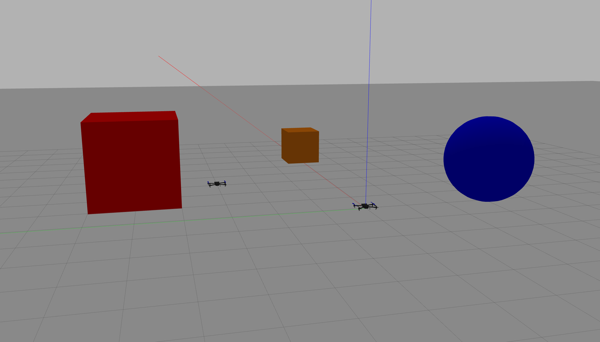
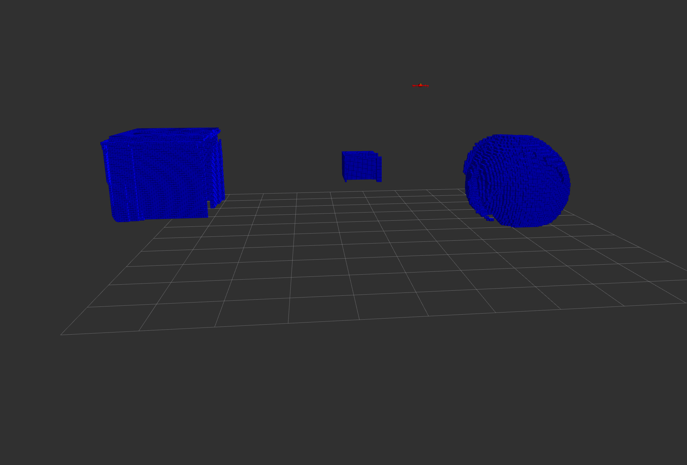

# <span style="color:green"> **Cyber-Physical Systems Programming - Documentation**</span>

The main goal of this work is the following: in a Gazebo environment we need to create the instances of 2 drones, equipped with the required sensors, like a depth camera, in order to build a 3D map of the simulated environment and localize the position of the drones themselves (SLAM algorithm = Simultaneous Localization and Mapping). The tools we will employ are ROS 2 and PX4 Autopilot.

>Leonardo Bellini\
>Lorenzo Grandi\
>Lorenzo Squarzoni

In the following document we'll explain all the steps required to execute a **Multiagent SITL SLAM**, based on two Iris drones equipped with a **depth camera**; the simulation will be carried out using Gazebo and Rviz2.

## <span style="color:lightgreen"> **Preliminary installations: ROS 2 Humble, PX4 Autopilot and Micro XRCE-DDS**</span>

**Ubuntu 22.04 LTS** (Jammy Jellyfish) must be installed on the PC.

To proceed with the installation, follow the main guide within the PX4 dcumentation:

https://docs.px4.io/main/en/ros2/user_guide.html

By default, from Ubuntu 22.04, PX4 comes with the newer Gazebo version (Gazebo Harmonic). If you want, as we did, work with the older version (Gazebo Classic), please follow this guide:

https://docs.px4.io/main/en/sim_gazebo_classic/

## <span style="color:lightgreen"> **Single drone simulation with PX4 in Gazebo**</span>

To run the basic single agent simulation, follow the guide at this link:

https://docs.px4.io/main/en/ros2/user_guide.html#setup-the-agent

If you installed Gazebo Classic rather than Gazebo Harmonic, replace the command starting PX4 with the ones provided at this link, depending on the vehicle you want to spawn:

https://docs.px4.io/main/en/sim_gazebo_classic/#running-the-simulation

If you decide to use an iris drone quipped with a depth camera as we did, run:
```Shell
cd PX4_Autopilot
make px4_sitl gazebo-classic_iris_depth_camera
```

### **ROS2 and PX4 simulation baseline**

The simulation is started by simply running the following commands from the shell:
```Shell
cd ros_ws
. install/setup.bash
ros2 launch px4_offboard offboard_velocity_control.launch.py
```
The launch file is a very useful ROS2 tool, since it allows to run several nodes, set parameters and more all from a single file. In our case, it handles the execution of the *processes.py* script, which initiates Micro XRCE-DDS and the Gazebo simulation, as well as launching Rviz, which is used as monitoring environment, and all the ROS2 nodes required for the mapping, that will be discussed in detail later.

Let's go through all the nodes and why they're needed.

#### **Map Frame publisher**

The **map_frame_publisher** script creates the common reference */map* frame with respect to the */world* frame; the two frames are actually the same, but since we couldn't create a new frame without specifying its parent, we were forced to create both. These will be the root frames of the TF Tree of the simulation: the latter describes the relative positions of all coordinates frames existing in the simulated world, either associated to the environment (as */world* and */map*) or to the drones (we will see this in a moment).

#### **Map Base Link publisher**

At *~/PX4-Autopilot/Tools/simulation/gazebo-classic/sitl_gazebo-classic/models* one can find the *.sdf* files of all available vehicles: the *.sdf* file describes how all the vehicles are made in terms of shape, dimensions and sensors. In particular, every component of the vehicle is attached to a **link**, defined in terms of position and orientation.

In the case of our iris drone equipped with the depth camera, the main link was *base_link* (this name is conventionally used for all models) while the sensor was associated to *camera_link*. This means that the Gazebo plugins will automatically publish the camera readings (image and pointcloud) on the corresponding ROS2 topic and those outputs will be referred to the *camera_link* frame.

In order to achieve this, we must provide within the TF Tree all the transformations from */map* to */camera_link*, namely */map &rarr; /base_link &rarr; camera_link*.

The scope of the **map_base_link_publ** is to provide the first transformation, from */map* to */base_link*. This operation requires to localize the drone in the environment, meaning to find its x, y, and z coordinates and orientation. These information were obtained by subscribing the */vehicle_local_position* and */vehicle_attitude* topics.

Since PX4 and ROS2 use respectively ENU (East-North-Up) and NED (North-East-Down) frame conventions, we needed to apply the corresponding conversions to publish the correct */map* to */base_link* transformation(refer to https://docs.px4.io/main/en/ros2/user_guide.html#ros-2-px4-frame-conventions).

To provide the second transformation, from */base_link* to */camera_link* we used the **robot_state_publisher** (https://github.com/ros/robot_state_publisher/tree/humble) and **joint_state_publisher** (https://github.com/ros/joint_state_publisher/tree/ros2) ROS2 nodes: by providing the drone description through a *.urdf* file, these two nodes manage to publish all the transformations from any frame within the drone to */base_link*.

The PX4 repository provides only the *.sdf* files of the vehicles, then we generate the *.urdf* file using the *pysdf* ROS package (https://github.com/andreasBihlmaier/pysdf). The result is the *iris_depth_camera.urdf* file within the *PX4_Files* folder.

#### **PointCloud transformer**

Even though the TF tree was fully generated and published, the topics associated to the camera were not automatically referred to the */map* reference frame. Consequently, we relaized a new ROS2 node, **pointcloud_transformer**, in order to provide the correct transformation of the topic's data.

Further more, we integrated in this node some other functionalities to improve the final mapping result. In particular:
- the ground is removed applying a filter to all data below 0.2 meters in the z direction;
- the pointclouds are downsampled in order to speed up the transmittion of data and remove all possible delays;
- based on the attitude topic of the drones, the data obtained when the drones are moving fast and rotating is removed, to avoid any drifting in the final octomap map; with a very little angle threshold we obtained a very good and clean result.

For all the pointcluds manipulations we used the *pcl_ros* ROS2 package (https://index.ros.org/p/pcl_ros/#humble-overview, https://docs.ros.org/en/humble/p/pcl_ros/index.html)

## <span style="color:lightgreen"> **Multiagent simulation with PX4 in Gazebo**</span>

When using Gazebo and ROS2 for multi-agent simulations, it's essential to ensure that each vehicle has unique topic and frame names to prevent conflicts. PX4 helps manage this with specific scripts designed for multi-agent simulations. In particular:
- **sitl_multiple_run.sh**: this shell script takes as inputs the vehicles type, the number of entities we want to spawn and the spawning coordinates.
- **jinja_gen.py**: this script, called by the previous one, is responsible of the *.sdf* files for all the entities by using the corresponding *.sdf.jinja* templates.
- **.sdf.jinja** file: it is a template-based version of an *.sdf* file, that allows to embed logic and variables in a text file, turning what normally is a static file into a dynamic one. In our case, the properties that must vary between vehicles are replaced by variables, with values passed as parameters by the **jinja_gen.py** script.

This partially helped us, but it was not sufficient for the following reasons:
- only some models come with the corresponding *sdf.jinja* template, and our iris drone with depth camera is not one of those;
- the previous scripts only account for different topics namespaces and proper MAVLink communication, but not for differentiated frames naming that is crucial for the camera's data publication.

Consequently we managed to write the *iris_depth_camera.sdf.jinja* template, which provides differentiated frames and topics naming for the camera, and we integrated these additional features also in the *sitl_multiple_run.sh* and *jinja_gen.py* in order to use the same workflow as in default PX4.

In addition, we extended all the previously discussed ROS2 nodes to a multiagent context. This led us to a fully working simulation, with two spawned drones and the corresponding cameras' readings published on the relative topics.

### **PointCloud combiner**

The last step before the final mapping was to merge the pointclouds coming from the drones' cameras into a single pointcloud: for this scope the **pointcloud_combiner** node was realized, that takes the two transformed and filtered pointclouds and joins them in one single topic, in order to feed it to the mapping process. Again, refer to the *pcl_ros* package documenation.

### **OctoMap**

As mapping tool for our simulation we used **Octomap** (https://octomap.github.io/): it produces a 3D Occupancy grid showing all the obstacles detected in the environment. Once the mapping is finished, the result can also be saved and imported in future simulations.

To run Octomap the *octomap_mapping.launch.xml* launch file within the *octomap_server* (https://github.com/OctoMap/octomap_mapping) package must be executed. In this file it is possible to specify both the reference frame, */map* in our case, and the topic where the pointcloud to be used as input of the mapping algorithm is going to be published (in our case, this pointcloud is th result of the merging process of the ones coming from the individual drones).

The result of the mapping can be monitored by showing in Rviz2 the topic called */occupied_cells_vis_array* of type *MarkerArray*.

### **Drones movements in the environment**

Now we need to control the drones movement and make them mapping the whole environment. We want the process to be repeatable, for this reason we'll use a C++ script, built as a ROS2 package called **px4_drones_control**. 

The script initially shows the trails that each drone will follow, characterized by a sequence of waypoints with the XYZ coordinates. The drones need to be armed and set to offboard mode before starting, then a series of functions will manage the movement of the drones, setting the trajectory they have to follow in terms of position, orientation and velocity. To asses whether a setpoint has been reached a simple distance computation is carried out.

We could control the movement also taking advantage of QGroundControl (https://docs.qgroundcontrol.com/master/en/qgc-user-guide/getting_started/download_and_install.html#ubuntu):

In our simulation is important to set some specific parameters before starting, in particular we need to deactivate the Manual Control Input setting required for safety reasons, in order to avoid to incurr into the Failsafe Mode. To do so we have to set  COM_RCL_EXCEPT = 4.

To specify these parameters there are many approaches, like using the px4 MAVLink Commands or changing manually the values in the PX4 folder:

go to **PX4-Autopilot/ROMFS/px4fmu_common/init.d-posix/** and add these lines to the file **px4-rc.params**:

```Shell
param set COM_ARM_WO_GPS 1  # Warning only when the GPS preflight check fails
param set COM_RCL_EXCEPT 4  # RC loss ignored and failsafe not triggered in offboard mode
param set COM_RC_IN_MODE 4  # Stick input disabled
param set LPE_GPS_Z 5.0     # Standard deviation for GPS
param set LPE_VIS_Z 2.0     # Standard deviation for vision
param set COM_LOW_BAT_ACT 0 # Warning only when batter failsafe is triggered
param set MPC_Z_P 0.1       # Proportional gain for vertical position error
```

The simulation carried out in Gazebo returned initially an unstable vertical position and acceleration, leading to various problems when trying to control the drones in offboard mode: when the system doesn't have a stable height estimation it doesn't allow to arm the drone and navigate. To reduce this observed oscillation we worked on the .sdf.jinja file responsible for generating the drones: in particular we increased the inertia of the components, added a small value of dampening to prevent vibrations and finally reduced the noise of both the accelerometer and gyroscope, almost completely nulling the vertical bouncing the drones had; in addition, when the registered position of the drones indicates a point below ground, the position is overwritten with a 0 value, just to clean the Rviz visualization.

Then the PX4 folder needs to be compiled to make the changes effective.

Once this is done we can proceed by setting the offboard mode and arming the drones in a separate terminal. The execution of this process cannot be inserted into the main launch file, because it would raise an error, not seeing all the topics and resources needed.

To run the script:
```Shell
cd ros_ws
colcon build
source ./install/setup.bash
ros2 run px4_drones_control px4_drones_control
```

## <span style="color:lightgreen"> **Results**</span>

The first picture represent the environment we wanted to map, with the three objects we placed:



The second picture instead is the map we obtained with a scanning process:



We can see that the floor removal partially eliminates the base of the objects, but makes the viewing of the results much clearer for our case; to improve this aspect we can simply reduce the vertical threshold or implement a floor segmentation approach used in this kind of problems, function that unfortunatelly would add much latency to the process.

The objects are slightly misaligned between the maps generated by the different vehicles, but they are quite precise considering the difficulty in retrieving a perfect and precise position for a system like a drone, moving freely in all directions.
